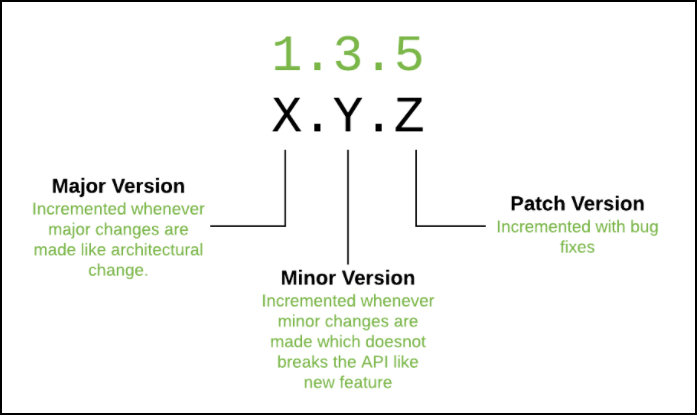
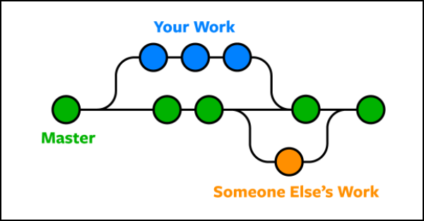

= Challenge 2

Your second challenge awaits! 

In this challenge, we want to see how comfortable you are explaining a technical topic.

Your audience is someone technical, but new to link:https://en.wikipedia.org/wiki/Version_control[version control^].

== Instructions

. Explain what a merge request/pull request is.
. Give examples on how to use it.

== Answer

// your answer goes here

= Version control guide

This guide provides a conceptual overview of the following concepts:

* Version control
* Cloning
* Branching
* Pull requests 
* Merging

Examples will be used to help illustrate these concepts where helpful.

'''

== Version control

Version control in software engineering relates to a change management system used to create software projects. These projects are created via a central master repository and a source control tool. An example of a source control tool is link:https://github.com/ [GitHub^].

Continuous revisions to this central project repository are often concurrently worked on by multiple contributors. 

A good exmaple of a version control system is semantic versioning, or link:https://semver.org/ [SemVer^]. This major. minor. patch versioning system organises a continuous release cycle using a consistent, three tiered, structured approach.

== Cloning

For a contributor to work on a version, they must first clone the central project repository locally. 

To clone a central repository, you must have access permission from the primary maintainer of the central project repository, and an account with the same source control tool.

For further info on cloning a repository in GitHub, see link: https://docs.github.com/en/repositories/creating-and-managing-repositories/cloning-a-repository [cloning a repository^]

== Branching

The contributor can now create a 'branch'.

A branch is a copy of the central repository of information at a certain point in time. An individual contributor can work on this branch independently of any ongoing changes to the central repository until they are ready to merge back into it.

== Pull requests

Once the individual contributor has finished working on their branch, they can then *push* their *commits* and open a *pull request*. For more on pushing commits, see link: https://docs.github.com/en/get-started/using-git/pushing-commits-to-a-remote-repository [pushing commits^].

A pull request is when a contributor asks the primary maintainer of a repository/or assigned reviewer to review the work they have done on their local branch back before merging it into the central project repository. 

The primary maintainer of the repository/assigned reviewer of the branch makes sure that there are no conflicts with the branch and the central repository. This review is necessary as other contributors may have branched off and merged into the repository in the time since the first cloning and branching in question, and important to make sure that there are no breaking changes that may occur when this merge takes place.

== Merging

After any conflicts have been resolved between the branch and central project repository, the original branch can be *merged* back into the central repository.

After all branches have been merged successfully, the central repository can be versioned appropriately and deployed as a software project release, finishing a phase of it's accompanying Software Development Life Cycle (SDLC).  

  