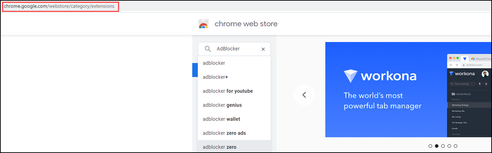
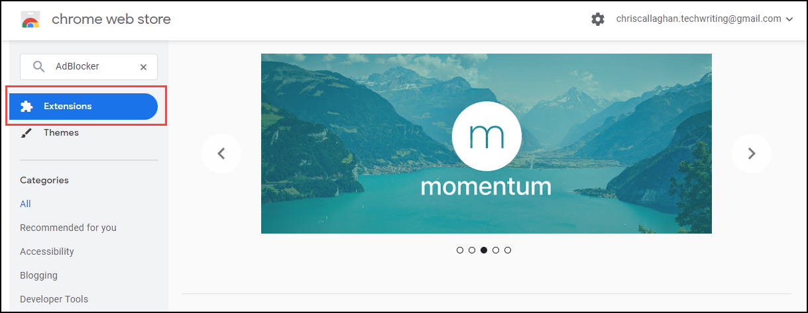
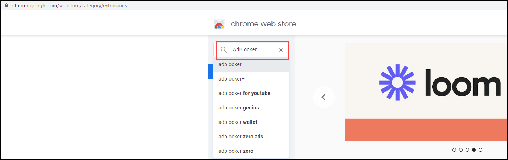
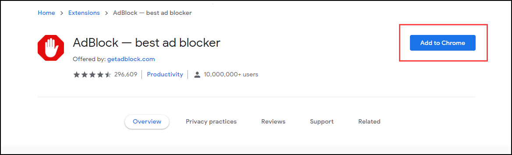

= Challenge 1

Your first challenge awaits! 

In this challenge, we want to get an idea of your writing style as it relates to software and computer technology.

== Instructions

. Choose any software or application that you use regularly.
. Write instructions on how to perform a common task related to the software or application.

.Example please?
****
Some ideas to get you started:

* Sending an attachment in link:https://signal.org/[Signal^].
* Forwarding an email with link:https://www.google.com/gmail/about/[Gmail^].
* Publishing a blog post with link:https://wordpress.com/[Wordpress^].
* Adding an extension to link:https://code.visualstudio.com/[Visual Studio Code^].
* Taking a screenshot with an link:https://www.apple.com/iphone/[iPhone^].
****

TIP: Keep the task concise. There's no need to over-complicate the instructions.

== Answer

// your answer goes here

= Download and install the AdBlock extension for Google Chrome

The following article guides you through the step by step process of downloading and installing the AdBlock extension for Google Chrome.

'''

== Downloading AdBlock

To download and install AdBlock:

. Open your Chrome browser and search for the *Chrome Web Store*, or use the following address: https://chrome.google.com/webstore/category/extensions.

[start=2]
. Select the *Extensions* tab.

[start=3]
. Search for and select *AdBlock* via the search box.

[start=4]
. Select *Add to Chrome*.

The AdBlock extension has now been added to your Google Chrome browser. 

*Note*: You can turn off the AdBlock extension at any time via the *Manage extensions* menu, accessible from the extensions icon  located on the header bar.